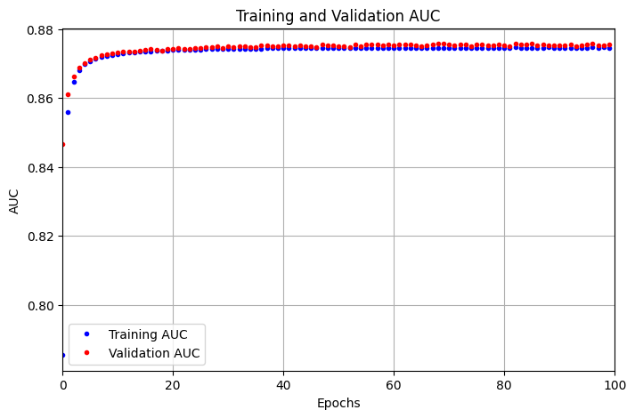

# Weather Prediction with Deep Learning


## Overview

This project involves the development of a Deep Learning model for predicting weather based on data from the Australia Bureau of Meteorology. The model is designed to provide accurate predictions for weather conditions, making use of historical meteorological data. The project is part of the Machine Learning Module from University of London (UoL) BSc Computer Science.

## Table of Contents

- [Introduction](#introduction)
- [Dataset](#dataset)
- [Model Architecture](#model-architecture)
- [Evaluation](#evaluation)
- [License](#license)
- [Acknowledgements](#acknowledgements)

## Introduction

In this project, we leverage Deep Learning techniques to predict weather conditions based on historical data. The model aims to provide accurate and timely forecasts, assisting in various applications, such as agriculture, transportation, and general weather awareness.

## Dataset

The dataset used for training and evaluation is sourced from the Australia Bureau of Meteorology. It includes historical weather data, covering parameters such as temperature, humidity, wind speed, and precipitation.

## Model Architecture

The Deep Learning model is implemented using TensorFlow and Keras. The architecture of the final model is as follows:

```python
from tensorflow.keras.models import Sequential
from tensorflow.keras.layers import Dense, Dropout

# Define the model architecture
model = Sequential()
model.add(Dense(32, activation='relu', input_shape=(,)))
model.add(Dropout(0.5))
model.add(Dense(32, activation='relu'))
model.add(Dropout(0.5))
model.add(Dense(32, activation='relu'))
model.add(Dropout(0.5))
model.add(Dense(32, activation='relu'))
model.add(Dropout(0.5))
model.add(Dense(1, activation='sigmoid'))

# Display the model summary
model.summary()
```
## Evaluation
The model is evaluated on various metrics such as accuracy, precision, recall, and area under the curve (AUC). As this project serves as a practice for model optimasation, all models developed are iteratively compared with the baseline performance. One of the training histories is shown below:



## License

This project is licensed under the MIT License.

## Acknowledgements

This project has made extensive reference to the book "Deep Learning with Python" by Francois Chollet. The development process follows the principles outlined in the "universal workflow of machine learning," as described in Chapter 4.5 of the book. The insights and methodologies presented in the book have significantly contributed to the design and implementation of the Deep Learning model for weather prediction in this project.
